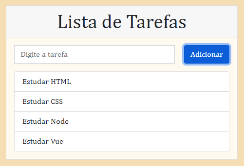

# Lista de Tarefas

## Sobre o projeto.
Lista de tarefas com base em JavaScript. Projeto desenvolvido para mudar a cor ao clicar em concluido e mostrar uma mensagem de aviso ao deletar uma tarefa.

Data de conclusão: 28/10/2021

## Ferramentas e tecnologias usadas nesse projeto.
```js    
function ListaDeTarefas(Project) {
    const FrontEnd = `${HTML}, ${CSS}, ${JavaScript}`;
};

``` 
<br>

<div align="center">



</div>

---

> - Autores: 
>   - [Eduardo Kayke](https://github.com/EduardoKayke "Perfil do Eduardo")

- [Voltar ao perfil do Github.](https://github.com/EduardoKayke "Perfil do Eduardo")

_Um dia seremos a tecnologia. Biohacking a própria evolução de nós mesmos._
